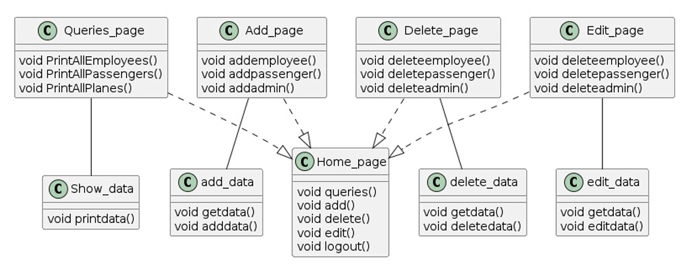
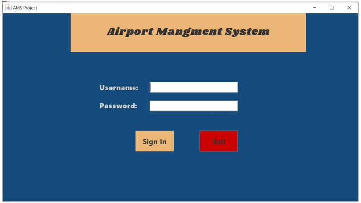
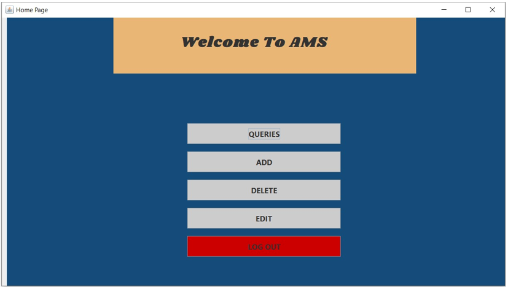
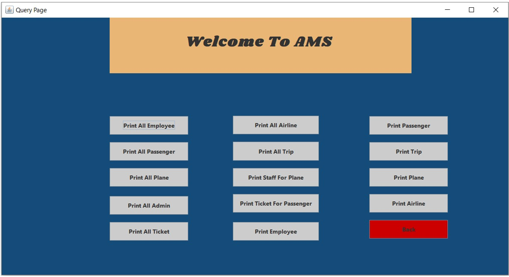

# Airport-Management-System-GUI
**The Airport Management System GUI Project is a comprehensive desktop application designed to facilitate the efficient management of airport operations 
through a user-friendly graphical interface. This system allows airport administrators, staff, and other users to interact seamlessly with the
airport’s database.**
# Class Diagram:

# Login Page:

# Brief:
**Login page help us to log in the Airport Manage System and the Admins can only log in to the System in AMS.**
# Home Page:

# Brief: 
**Home Page Flow Control the System and help us to reach to Query page , Add page ,Delete page , Edit page in AMS.**
# QuieryPage:

# Brief: 
**Query Page help us to show data for  All Employees , All Passengers , All planes , All Admins , 
All Tickets , All Airlines , All Trips , Staff for Employee , Ticket For Passengers , Specific 
Employee ,  Specific Passenger , Specific Trip , Specific plane and Specific Airline in AMS.**
